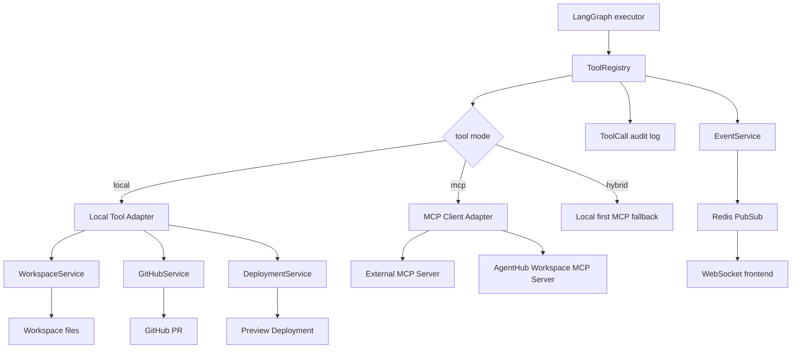

# AgentHub MCP 改造实施文档

>   目标：在不破坏现有 FastAPI、Celery、LangGraph、Workspace、Diff、PR、Deploy 流程的前提下，为 AgentHub 引入 MCP 能力。

---

## 0. 当前项目背景

当前项目是一个多 Agent 协作平台，核心链路已经包括：

```text
用户消息
-> FastAPI 保存 Message
-> 解析 @orchestrator / @qwen / @mock
-> 创建 Task
-> Celery Worker 执行任务
-> LangGraph Orchestrator 规划和执行
-> WorkspaceService 修改代码文件
-> 生成 CodeChange 和 Git Diff
-> 用户 Accept / Reject / Revise / Review
-> 创建 GitHub PR
-> 创建本地 Preview Deployment
-> Redis PubSub + WebSocket 实时推送事件
```

当前 Agent 修改代码的方式是：

```text
LLM 输出文本标记
[FILE: relative/path]
```language
content
```
[DELETE: relative/path]
[RENAME: old/path -> new/path]

后端用正则解析这些文本标记，然后调用 WorkspaceService 执行文件写入、删除、重命名。
```

这套机制已经能跑通，但它是自定义协议。MCP 改造的核心目的，是把这些工具能力标准化，让 Agent 可以通过标准工具接口调用 Workspace、Git、GitHub、Deployment 等能力。

---

## 1. MCP 改造目标

### 1.1 总目标

为 AgentHub 引入一层标准化工具调用架构，使项目具备以下能力：

```text
1. Agent 可以通过统一 ToolRegistry 调用工具
2. 本地工具和 MCP 工具可以共存
3. WorkspaceService、Git、GitHub、Deployment 能力可以逐步包装为 MCP tools
4. AgentHub 可以作为 MCP Client 调用外部 MCP Server
5. AgentHub 后期可以作为 MCP Server 对外暴露任务、Diff、PR、部署能力
6. 所有高风险工具调用都有权限校验、日志记录和人工确认入口
```

### 1.2 不做的事情

本次改造不要做这些事情：

```text
1. 不要重写整个后端架构
2. 不要删除现有 WorkspaceService
3. 不要删除现有 [FILE:] 文本标记能力
4. 不要一次性把所有 Agent 执行改成 MCP
5. 不要让高风险工具自动执行 push、PR、deploy
6. 不要绕过现有用户资源权限校验
```

本次目标是“渐进式引入 MCP”，不是“全项目 MCP 化”。

---

## 2. 推荐总体架构



核心思想：

```text
Agent 不直接调用 WorkspaceService
Agent 调用 ToolRegistry
ToolRegistry 决定调用本地工具还是 MCP 工具
工具调用结果统一记录日志、广播事件、返回结构化结果
```

---

## 3. 第一阶段：新增本地 ToolRegistry

第一阶段先不真正启动 MCP Server，而是先把现有能力抽象成统一工具接口。这一步必须保持现有功能兼容。

### 3.1 新增目录

新增：

```text
app/tools/
├── __init__.py
├── base.py
├── registry.py
├── permissions.py
├── workspace_tools.py
├── git_tools.py
├── github_tools.py
├── deployment_tools.py
└── audit.py
```

### 3.2 新增基础模型

在 `app/tools/base.py` 中定义：

```python
from enum import Enum
from pydantic import BaseModel, Field
from typing import Any, Callable, Awaitable


class ToolRiskLevel(str, Enum):
    LOW = "low"
    MEDIUM = "medium"
    HIGH = "high"


class ToolCallRequest(BaseModel):
    name: str
    arguments: dict[str, Any] = Field(default_factory=dict)
    task_id: int | None = None
    conversation_id: int | None = None
    user_id: int | None = None
    require_confirmation: bool = False


class ToolCallResult(BaseModel):
    success: bool
    content: str = ""
    structured_content: dict[str, Any] = Field(default_factory=dict)
    error: str | None = None


class ToolDefinition(BaseModel):
    name: str
    description: str
    risk_level: ToolRiskLevel = ToolRiskLevel.LOW
    input_schema: dict[str, Any] = Field(default_factory=dict)
    output_schema: dict[str, Any] | None = None
```

### 3.3 新增 ToolRegistry

在 `app/tools/registry.py` 中实现：

```python
from typing import Callable, Awaitable
from app.tools.base import ToolCallRequest, ToolCallResult, ToolDefinition, ToolRiskLevel


ToolHandler = Callable[[ToolCallRequest], Awaitable[ToolCallResult]]


class ToolRegistry:
    def __init__(self):
        self._definitions: dict[str, ToolDefinition] = {}
        self._handlers: dict[str, ToolHandler] = {}

    def register(self, definition: ToolDefinition, handler: ToolHandler) -> None:
        self._definitions[definition.name] = definition
        self._handlers[definition.name] = handler

    def list_tools(self) -> list[ToolDefinition]:
        return list(self._definitions.values())

    def get_tool(self, name: str) -> ToolDefinition | None:
        return self._definitions.get(name)

    async def call(self, request: ToolCallRequest) -> ToolCallResult:
        definition = self._definitions.get(request.name)
        if definition is None:
            return ToolCallResult(success=False, error=f"Unknown tool: {request.name}")

        if definition.risk_level == ToolRiskLevel.HIGH and not request.require_confirmation:
            return ToolCallResult(
                success=False,
                error=f"Tool {request.name} requires user confirmation before execution.",
            )

        handler = self._handlers[request.name]
        return await handler(request)


tool_registry = ToolRegistry()
```

### 3.4 工具风险分级

工具分级如下：

```text
低风险：
- workspace.list_files
- workspace.read_file
- workspace.get_diff
- workspace.get_changed_files

中风险：
- workspace.write_file
- workspace.rename_file

高风险：
- workspace.delete_file
- git.commit_changes
- git.push_branch
- github.create_pull_request
- deployment.create_local_preview
```

第一阶段只开放低风险和中风险工具给 Agent 自动调用。高风险工具只允许通过现有 API 的用户确认流程调用。

---

## 4. 第二阶段：把 WorkspaceService 包装成本地 tools

### 4.1 新增 workspace_tools.py

在 `app/tools/workspace_tools.py` 中封装以下工具：

```text
workspace.write_file
workspace.delete_file
workspace.rename_file
workspace.get_diff
workspace.get_changed_files
```

注意：

```text
1. 所有文件路径必须继续复用 WorkspaceService.validate_path
2. 不允许新增任何绕过 validate_path 的文件操作
3. 不允许读取或写入 .env、.git、.ssh、密钥文件
4. write_file 必须继续限制文件大小
5. 每次工具调用都要产生 task.log 事件
```

### 4.2 示例实现

```python
from app.tools.base import ToolCallRequest, ToolCallResult, ToolDefinition, ToolRiskLevel
from app.tools.registry import tool_registry
from app.services.workspace_service import workspace_service, WorkspaceError
from app.db.session import SessionLocal
from app.models.task import Task


async def workspace_write_file(request: ToolCallRequest) -> ToolCallResult:
    local_path = request.arguments.get("local_path")
    target_file = request.arguments.get("target_file")
    content = request.arguments.get("content", "")

    if not local_path or not target_file:
        return ToolCallResult(success=False, error="local_path and target_file are required")

    db = SessionLocal()
    try:
        task = db.get(Task, request.task_id) if request.task_id else None
        await workspace_service.write_file(local_path, target_file, content, task=task)
        return ToolCallResult(
            success=True,
            content=f"File written: {target_file}",
            structured_content={"changed_files": [target_file]},
        )
    except WorkspaceError as exc:
        return ToolCallResult(success=False, error=str(exc))
    finally:
        db.close()


def register_workspace_tools() -> None:
    tool_registry.register(
        ToolDefinition(
            name="workspace.write_file",
            description="Write text content to a relative file inside the current repository workspace.",
            risk_level=ToolRiskLevel.MEDIUM,
            input_schema={
                "type": "object",
                "properties": {
                    "local_path": {"type": "string"},
                    "target_file": {"type": "string"},
                    "content": {"type": "string"},
                },
                "required": ["local_path", "target_file", "content"],
            },
        ),
        workspace_write_file,
    )
```

### 4.3 初始化工具注册

新增：

```text
app/tools/__init__.py
```

内容：

```python
from app.tools.workspace_tools import register_workspace_tools


def register_builtin_tools() -> None:
    register_workspace_tools()
```

在 FastAPI 启动时或 worker 启动时调用 `register_builtin_tools()`。

建议在以下位置调用：

```text
1. app/main.py 启动时
2. app/workers/agent_tasks.py 模块加载时
```

确保 API 进程和 Celery Worker 进程都能访问工具注册表。

---

## 5. 第三阶段：改造 execute_node 的文件操作执行方式

当前 `execute_node` 中有逻辑：

```python
changed_files = await workspace_service.apply_operations_from_text(repo_path, content, task=child_task)
```

暂时不要删除这套逻辑。改造为：

```text
1. 继续让 LLM 输出 [FILE:] [DELETE:] [RENAME:] 标记
2. 解析标记后，不直接调用 WorkspaceService
3. 改为调用 ToolRegistry 中的 workspace tools
4. 返回 changed_files
```

### 5.1 新增工具化解析函数

在 `app/tools/workspace_tools.py` 或 `app/tools/agent_file_ops.py` 中新增：

```python
import re
from app.tools.base import ToolCallRequest
from app.tools.registry import tool_registry


async def apply_file_operations_with_tools(
    local_path: str,
    content: str,
    task_id: int | None = None,
    conversation_id: int | None = None,
) -> list[str]:
    changed_files: list[str] = []

    for match in re.finditer(r"\[RENAME:\s*(.+?)\s*->\s*(.+?)\s*\]", content):
        source_file = match.group(1).strip()
        target_file = match.group(2).strip()
        result = await tool_registry.call(ToolCallRequest(
            name="workspace.rename_file",
            task_id=task_id,
            conversation_id=conversation_id,
            arguments={
                "local_path": local_path,
                "source_file": source_file,
                "target_file": target_file,
            },
        ))
        if result.success:
            changed_files.extend([source_file, target_file])
        else:
            raise RuntimeError(result.error or "rename_file failed")

    for match in re.finditer(r"\[DELETE:\s*(.+?)\s*\]", content):
        target_file = match.group(1).strip()
        result = await tool_registry.call(ToolCallRequest(
            name="workspace.delete_file",
            task_id=task_id,
            conversation_id=conversation_id,
            require_confirmation=False,
            arguments={"local_path": local_path, "target_file": target_file},
        ))
        if result.success:
            changed_files.append(target_file)
        else:
            raise RuntimeError(result.error or "delete_file failed")

    file_pattern = r"\[FILE:\s*(.+?)\]\s*\n\s*```.*?\n([\s\S]*?)\n```"
    for match in re.finditer(file_pattern, content):
        file_path = match.group(1).strip()
        file_content = match.group(2)
        result = await tool_registry.call(ToolCallRequest(
            name="workspace.write_file",
            task_id=task_id,
            conversation_id=conversation_id,
            arguments={
                "local_path": local_path,
                "target_file": file_path,
                "content": file_content,
            },
        ))
        if result.success:
            changed_files.append(file_path)
        else:
            raise RuntimeError(result.error or "write_file failed")

    return list(dict.fromkeys(changed_files))
```

### 5.2 修改 nodes.py

将：

```python
changed_files = await workspace_service.apply_operations_from_text(repo_path, content, task=child_task)
```

替换为：

```python
from app.tools.agent_file_ops import apply_file_operations_with_tools

changed_files = await apply_file_operations_with_tools(
    repo_path,
    content,
    task_id=child_task.id if child_task else None,
    conversation_id=state.get("conversation_id"),
)
```

保留 WorkspaceService 原函数作为兼容备用，不要删除。

---

## 6. 第四阶段：增加 ToolCall 审计日志

### 6.1 新增数据库模型

新增文件：

```text
app/models/tool_call.py
```

字段建议：

```python
class ToolCall(Base):
    __tablename__ = "tool_calls"

    id: Mapped[int] = mapped_column(primary_key=True, index=True)
    task_id: Mapped[int | None] = mapped_column(ForeignKey("tasks.id"), nullable=True, index=True)
    conversation_id: Mapped[int | None] = mapped_column(ForeignKey("conversations.id"), nullable=True, index=True)
    user_id: Mapped[int | None] = mapped_column(ForeignKey("users.id"), nullable=True, index=True)
    tool_name: Mapped[str] = mapped_column(String(200), index=True, nullable=False)
    risk_level: Mapped[str] = mapped_column(String(30), default="low", nullable=False)
    arguments_json: Mapped[str] = mapped_column(Text, nullable=False)
    result_json: Mapped[str | None] = mapped_column(Text, nullable=True)
    success: Mapped[bool] = mapped_column(Boolean, default=False, nullable=False)
    error_message: Mapped[str | None] = mapped_column(Text, nullable=True)
    created_at: Mapped[datetime] = mapped_column(DateTime(timezone=True), server_default=func.now())
```

### 6.2 Alembic 迁移

新增 migration：

```text
alembic revision -m "create tool_calls table"
alembic upgrade head
```

### 6.3 ToolRegistry 写审计

在 `ToolRegistry.call()` 中：

```text
1. 调用前记录 tool name、risk level、arguments
2. 调用后记录 success、structured_content、error
3. 对敏感参数做脱敏，例如 token、password、secret、api_key
4. 产生 task.log 事件
```

不要在日志里保存 GitHub token、环境变量、完整 .env 内容。

---

## 7. 第五阶段：引入 MCP Python SDK

### 7.1 修改 requirements.txt

新增：

```text
mcp[cli]
```

当前 requirements 已经有 FastAPI、Celery、Redis、GitPython、PyGithub、httpx 等依赖，所以新增 MCP SDK 即可。

### 7.2 新增 MCP 配置

在 `app/core/config.py` 中增加：

```python
mcp_enabled: bool = False
mcp_tool_mode: str = "local"  # local | mcp | hybrid
mcp_workspace_server_url: str | None = None
mcp_internal_token: str | None = None
```

含义：

```text
local：只使用本地 ToolRegistry
mcp：优先通过 MCP Client 调用 MCP Server
hybrid：本地工具优先，外部 MCP 作为补充
```

默认必须是 `local`，确保现有功能不受影响。

---

## 8. 第六阶段：实现 Workspace MCP Server

### 8.1 新增目录

```text
app/mcp/
├── __init__.py
├── workspace_server.py
├── client.py
└── permissions.py
```

### 8.2 Workspace MCP Server 目标

先暴露低风险工具：

```text
workspace_get_diff
workspace_get_changed_files
workspace_write_file
workspace_rename_file
```

暂时不要暴露：

```text
workspace_delete_file
commit_changes
push_branch
create_pr
deploy_preview
```

如果必须暴露，必须要求 `confirmed=true` 并且通过 AgentHub 现有业务 API 进行确认。

### 8.3 示例 workspace_server.py

```python
from pydantic import BaseModel
from mcp.server.fastmcp import FastMCP
from app.services.workspace_service import workspace_service

mcp = FastMCP("AgentHub Workspace MCP", json_response=True)


class WriteFileResult(BaseModel):
    changed_files: list[str]
    message: str


@mcp.tool()
async def workspace_write_file(local_path: str, target_file: str, content: str) -> WriteFileResult:
    """Write a file inside the AgentHub repository workspace after path safety validation."""
    await workspace_service.write_file(local_path, target_file, content)
    return WriteFileResult(changed_files=[target_file], message=f"File written: {target_file}")


@mcp.tool()
def workspace_get_diff(local_path: str) -> dict:
    """Return git diff for the current AgentHub workspace."""
    diff = workspace_service.get_diff(local_path)
    return {"diff": diff}


@mcp.tool()
def workspace_get_changed_files(local_path: str) -> dict:
    """Return changed file paths for the current AgentHub workspace."""
    files = workspace_service.get_changed_files(local_path)
    return {"changed_files": files}


if __name__ == "__main__":
    mcp.run(transport="streamable-http")
```

注意：

```text
1. MCP Server 内部仍然复用 WorkspaceService
2. 不要直接使用 Path.write_text 绕过 WorkspaceService
3. 返回值尽量使用 Pydantic model 或 dict，便于 structured output
```

---

## 9. 第七阶段：实现 MCP Client Adapter

### 9.1 新增 `app/mcp/client.py`

目标：封装对 MCP Server 的调用，让 ToolRegistry 不关心底层 transport。

伪代码：

```python
class MCPToolClient:
    def __init__(self, server_url: str):
        self.server_url = server_url

    async def list_tools(self) -> list[dict]:
        ...

    async def call_tool(self, name: str, arguments: dict) -> dict:
        ...
```

如果 MCP SDK 的 HTTP client API 变动较大，可以先实现一个轻量适配层，后续再替换具体 SDK 调用。不要把 MCP SDK 的调用细节散落在 `nodes.py` 或 service 里。

### 9.2 在 ToolRegistry 中增加 mcp mode

根据 `settings.mcp_tool_mode` 决定：

```text
local：调用本地 handler
mcp：调用 MCPToolClient
hybrid：本地有 handler 就本地调用，否则查 MCP tools
```

### 9.3 失败回退

MCP 调用失败时：

```text
1. 记录 ToolCall error
2. 发送 task.log
3. 如果 mode 是 hybrid 且存在本地 handler，回退本地工具
4. 如果无回退，返回 ToolCallResult(success=False)
```

---

## 10. 第八阶段：AgentHub 自身作为 MCP Server

这一阶段放到最后做。目标是让外部 MCP Client 可以调用 AgentHub 能力。

### 10.1 暴露 Resources

建议 URI：

```text
agenthub://conversations/{conversation_id}
agenthub://tasks/{task_id}
agenthub://tasks/{task_id}/children
agenthub://code_changes/{code_change_id}/diff
agenthub://deployments/{deployment_id}/logs
agenthub://repositories/{repository_id}
```

资源只读，不产生副作用。

### 10.2 暴露 Tools

低风险 tools：

```text
agenthub_get_task_status
agenthub_list_task_children
agenthub_get_code_change_diff
agenthub_get_deployment_logs
```

需要用户确认的高风险 tools：

```text
agenthub_confirm_plan
agenthub_accept_code_change
agenthub_reject_code_change
agenthub_create_pull_request
agenthub_create_deployment
agenthub_cancel_task
```

### 10.3 权限要求

任何 AgentHub MCP Server tool 必须校验：

```text
1. 调用者身份
2. user_id 是否拥有 conversation/task/repository/code_change
3. 高风险操作是否已经确认
4. 是否超过 rate limit
```

可以复用当前 `get_owned_conversation`、`get_owned_task`、`get_owned_repository`、`get_owned_code_change` 的权限逻辑。

---

## 11. 安全要求

MCP 改造必须遵守以下要求：

```text
1. 工具输入必须用 Pydantic 或 JSON Schema 校验
2. 文件路径必须复用 WorkspaceService.validate_path
3. 禁止访问 .env、.git、.ssh、密钥文件
4. 高风险工具必须走人工确认
5. ToolCall 必须审计入库
6. 工具输出传给 LLM 前必须做长度限制和敏感信息过滤
7. 工具调用必须有超时
8. MCP Server 不得默认暴露到公网
9. MCP Server 若开启 HTTP transport，必须有 token 或本地网络限制
10. 不允许把 GitHub token 写入日志、事件、ToolCall arguments_json
```

---

## 12. 测试计划

### 12.1 单元测试

新增测试：

```text
tests/test_tool_registry.py
tests/test_workspace_tools.py
tests/test_mcp_workspace_server.py
```

测试点：

```text
1. ToolRegistry 可以注册和调用工具
2. unknown tool 返回错误
3. 高风险工具未确认时拒绝执行
4. workspace.write_file 可以写入 workspace 内文件
5. workspace.write_file 拒绝 ../evil.txt
6. workspace.write_file 拒绝 .env
7. workspace.get_diff 能返回 diff
8. ToolCall 审计记录成功和失败
```

### 12.2 集成测试

测试原有主链路：

```text
1. 注册登录正常
2. 创建仓库正常
3. 创建会话正常
4. @mock 正常
5. @qwen 正常
6. @orchestrator 第一次生成 plan 并等待确认
7. confirm plan 后继续执行
8. 执行后生成 CodeChange
9. accept/reject/revise/review 正常
10. create PR 和 deployment 原有流程不回归
```

### 12.3 MCP 模式测试

```text
1. mcp_tool_mode=local 时，行为与旧版本一致
2. mcp_tool_mode=mcp 时，可以通过 MCP Server 调用 workspace_write_file
3. mcp_tool_mode=hybrid 时，本地工具优先，MCP 失败后有清晰错误日志
```

---

## 13. 验收标准

完成后必须满足：

```text
1. 原有接口不报错
2. 原有 [FILE:] 文件操作仍然可用
3. Workspace 文件操作已经经过 ToolRegistry
4. ToolCall 有审计记录
5. requirements.txt 增加 mcp[cli]
6. mcp_tool_mode 默认 local
7. 至少实现一个 Workspace MCP Server
8. 至少实现 workspace_write_file 和 workspace_get_diff 两个 MCP tools
9. 高风险工具不能被 Agent 自动调用
10. 所有新增代码有清晰注释和测试
```

---

## 14. 给 Codex 或 Gemini CLI 的执行提示词

可以直接复制以下内容给代码 Agent：

```text
请基于当前 AgentHub 后端项目进行 MCP 渐进式改造。不要重写整个项目，不要破坏现有 FastAPI、Celery、LangGraph、Workspace、Diff、PR、Deployment 流程。

请按以下顺序实现：

1. 新增 app/tools 模块，包含 base.py、registry.py、workspace_tools.py、agent_file_ops.py、audit.py。
2. 定义 ToolCallRequest、ToolCallResult、ToolDefinition、ToolRiskLevel。
3. 实现 ToolRegistry，支持注册工具、调用工具、高风险工具确认检查。
4. 将 WorkspaceService 的 write_file、delete_file、rename_file、get_diff、get_changed_files 封装为本地 tools。所有文件路径必须继续复用 WorkspaceService.validate_path。
5. 新增 apply_file_operations_with_tools，用 ToolRegistry 执行 [FILE:]、[DELETE:]、[RENAME:] 解析后的文件操作。
6. 修改 app/agents/graph/nodes.py 中 execute_node 的文件操作逻辑，让它调用 apply_file_operations_with_tools，而不是直接调用 workspace_service.apply_operations_from_text。保留旧函数作为兼容备用。
7. 新增 ToolCall 数据库模型和 Alembic 迁移，用于记录工具调用审计日志。敏感字段必须脱敏。
8. 修改 requirements.txt，增加 mcp[cli]。
9. 在 app/core/config.py 中增加 mcp_enabled、mcp_tool_mode、mcp_workspace_server_url、mcp_internal_token，默认 mcp_tool_mode=local。
10. 新增 app/mcp/workspace_server.py，使用 FastMCP 暴露 workspace_write_file、workspace_get_diff、workspace_get_changed_files 三个工具。
11. 新增 app/mcp/client.py，封装 MCP tool list 和 tool call，后续给 ToolRegistry 使用。
12. 给新增模块补充测试，确保原有流程不回归。

安全要求：
- 不允许绕过 WorkspaceService.validate_path。
- 不允许访问 .env、.git、.ssh、密钥文件。
- delete、commit、push、create_pr、deploy 都属于高风险工具，未确认不得自动执行。
- 不允许把 GitHub token 或其他 secret 写入日志。

请分小步提交修改，每步保证项目可以运行。
```

---

## 15. 后续可选增强

等基础 MCP 工具层稳定后，再做：

```text
1. AgentHub 作为 MCP Server 暴露 task、diff、PR、deployment resources
2. 接入外部 GitHub MCP Server
3. 接入文件系统 MCP Server
4. 接入数据库 MCP Server
5. 把 LangGraph executor 从文本标记解析升级为真正 tool calling
6. 为高风险 MCP tool 增加前端确认弹窗
7. 为 ToolCall 增加前端工具调用时间线
8. 增加 MCP Inspector 调试说明
```

---

## 16. 最终目标状态

最终希望形成以下链路：

```text
用户消息
-> Orchestrator 生成 plan
-> 用户确认 plan
-> executor 执行 step
-> LLM 决定需要工具
-> ToolRegistry 选择本地 tool 或 MCP tool
-> 工具执行并记录 ToolCall
-> 结果返回 verifier
-> verifier 判断是否继续
-> summarizer 汇总
-> CodeChange / Review / PR / Deployment 闭环
-> WebSocket 实时展示全过程
```

这样 AgentHub 就不只是一个自定义多 Agent 平台，而是一个可以接入 MCP 生态的 Agent 应用工程平台。
