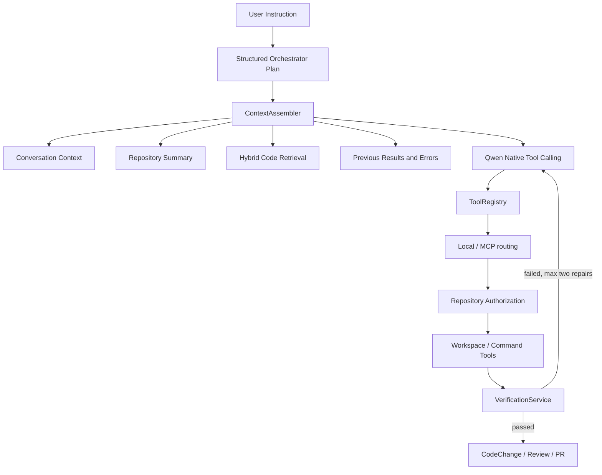

# Hardened Agent Architecture

本文描述 AgentHub 开发 Agent 的输入、决策、工具执行、验证与评测链路。核心原则是：模型负责提出结构化意图，确定性代码负责身份、路径、命令、事务与预算边界。

## End-to-end data flow

Orchestrator 使用 `OrchestratorPlan` 和 `PlanStep` 的结构化输出，agent 只能是 `backend`、`frontend` 或 `reviewer`。解析失败经过有限重试后返回安全的单步 backend fallback，不再从 Markdown 或正则中提取 JSON。

## Context engineering

`ContextAssembler` 把每段上下文标记为 System、Current Request、Error、Execution Result、Retrieval、Repository 或 Conversation，并用稳定的 `ceil(chars / 4)` 估算 token。默认输入预算是 22,000 token，另保留 2,000 token 响应空间。优先级为：

1. System 安全规则；
2. 当前需求；
3. 当前错误；
4. 前序执行结果；
5. 检索代码；
6. 仓库摘要；
7. 最近对话。

System 与当前需求不会被删除；低优先级块先截断。最近对话最多加载 20 条，保留最近消息，并以抽取式摘要保留约束、文件、命令、错误和未完成事项。Repository 摘要只包含相对结构、语言、包管理器、测试/构建信息、branch 和 commit，不包含绝对路径。

检索使用关键词候选与 Hash/OpenAI-compatible embedding 向量候选，再以 Reciprocal Rank Fusion 合并。返回块带相对路径、行号、符号和评分，并明确标记为不可信数据，不能覆盖 System 指令。

## Execution and repair

Qwen 只看到 ToolRegistry 发布的 JSON Schema。`repository_id`、`user_id` 和 `local_path` 不属于模型参数：前两者由可信任务上下文注入，后者仅由 `RepositoryResolver` 从数据库解析。

文件工具经过 WorkspaceService 的路径边界检查。命令工具只支持枚举化测试、lint、类型检查与 build；`shell=False`、固定 cwd、过滤环境、超时、进程树终止和输出上限共同限制执行面。

`VerificationService` 根据 changed files 与项目配置选择 pytest、Ruff、mypy、前端 test/build 或 documentation-only 检查。失败摘要进入下一轮 `previous_error`；每个步骤最多自动修复两次，第三次失败会把父任务标记为失败，避免假成功和无限循环。

## Persistence, checkpoint, and memory

- SQLAlchemy 保存业务事实：Repository、Task、CodeChange、ToolCall 与 CodeChunk。
- LangGraph checkpoint 保存一次工作流的可恢复执行状态与 HITL 中断点。
- Conversation message 是跨任务的用户/Agent 历史。
- RAG index 是可重建的仓库派生数据，不是业务真相。

Checkpoint 回答“工作流执行到哪里”；Memory/Conversation 回答“过去交流了什么”。两者不能互相替代。

## Observability and evaluation

关键链路输出脱敏 JSON 事件，包括 task/repository identity、工具名、耗时、成功状态、错误类型、context token、检索块数、命令退出码和验证状态。日志不记录 prompt、完整代码、Authorization、token 或绝对工作区路径。

`python -m evals.run --mode offline` 使用固定 Planner/Retrieval 数据集、Hash embedding 与 fake command runner 生成 JSON/Markdown 报告，并以阈值决定退出码。详情见 [agent-evaluation.md](agent-evaluation.md)。

## Interview discussion questions

### Structured Output 为什么比 JSON Prompt 稳定？

Schema 约束发生在模型接口和 Pydantic 校验层，非法 agent、缺字段与步数越界会显式失败；JSON Prompt 仍依赖自由文本遵从，容易混入 Markdown、解释或半截 JSON。

### Tool Calling 与 MCP 的职责区别？

Tool Calling 是模型表达“调用哪个工具及参数”的协议；MCP 是工具发现与远程执行的传输/服务协议。ToolRegistry 可以在 Local、MCP 或 Hybrid 路由下复用同一模型工具契约。

### Authentication、Authorization、路径校验的区别？

MCP bearer token 认证调用方；RepositoryResolver 验证 user 是否拥有 repository；WorkspaceService 再验证相对路径没有逃逸仓库。三层分别回答“你是谁”“你能访问哪个仓库”“这个具体路径是否在边界内”。

### 为什么禁止任意 Shell？

任意 shell 会引入命令拼接、重定向、子 shell、环境泄露和跨目录破坏。枚举 argv + `shell=False` 把能力收敛到可测试、可审计的开发检查。

### RAG 为什么使用混合检索？

关键词检索擅长精确符号，向量检索擅长概念相似；RRF 在不校准两类原始分数的情况下融合排名，并允许任一来源缺失时降级。

### Checkpoint 与 Memory 的区别？

Checkpoint 是工作流控制状态；Memory 是可供未来推理使用的历史语义。恢复节点不能只靠聊天记录，长期上下文也不应无限塞入 checkpoint。

### Context Engineering 如何控制 Token？

每个来源有预算与优先级，响应空间预留，RAG 限块，Conversation 限最近消息，低优先级先截断；日志记录 token 和截断数量以便调优。

### Agent 如何自动验证和修复？

Verifier 执行真实测试/lint/type/build，把命令、退出码与截断 stderr 作为结构化错误交回同一步 Agent，最多两次修复，仍失败则明确终止。

### 如何评估 Agent，而不是只看 Demo？

用固定 case 计算 schema success、fallback、Recall@5、MRR、context truncation、tool success、verification pass 和 tool rounds，并设置 CI 可执行阈值。Demo 用于解释，eval 用于回归。
