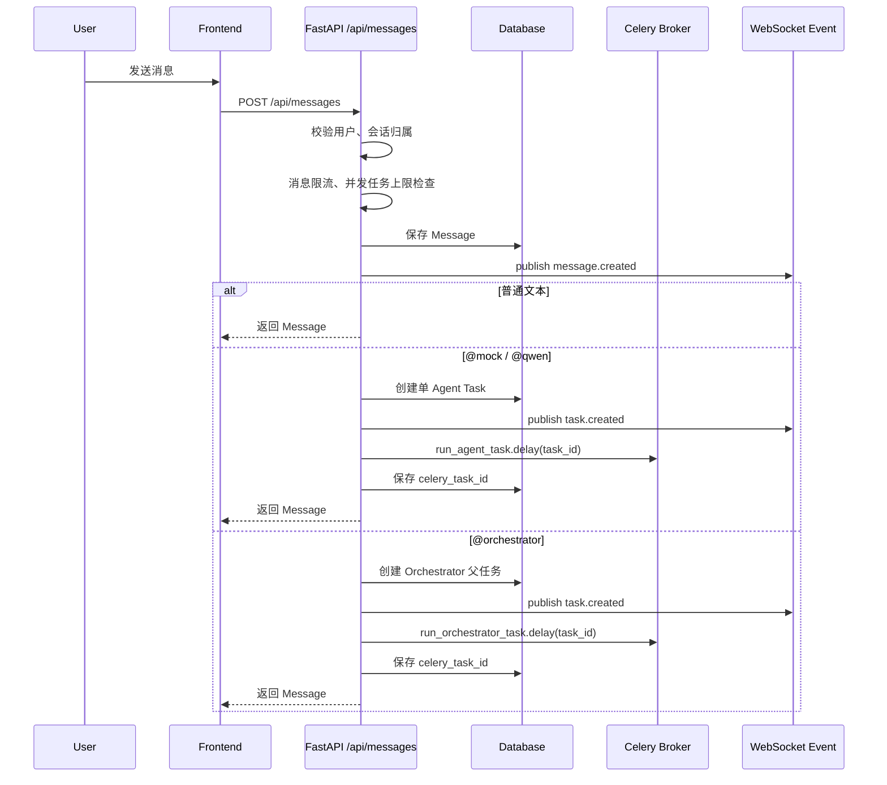
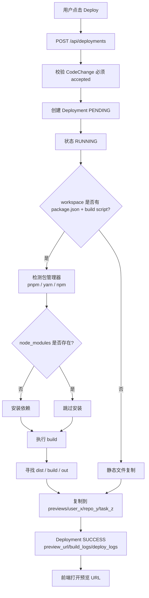
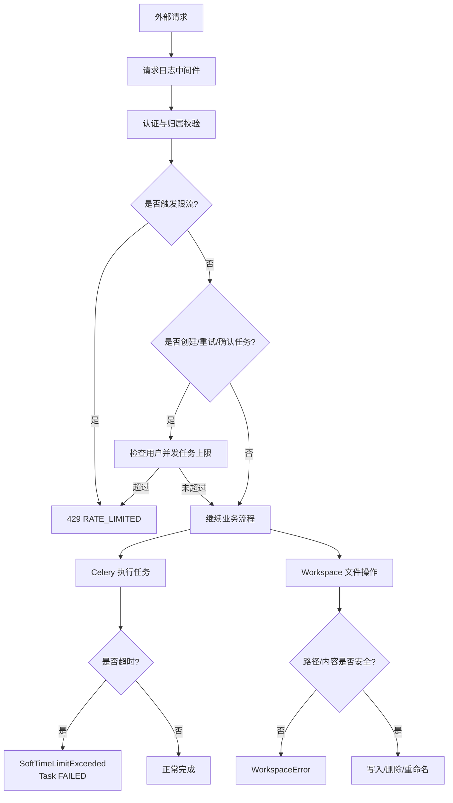
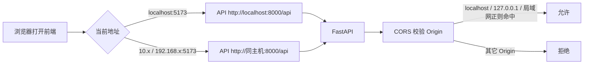
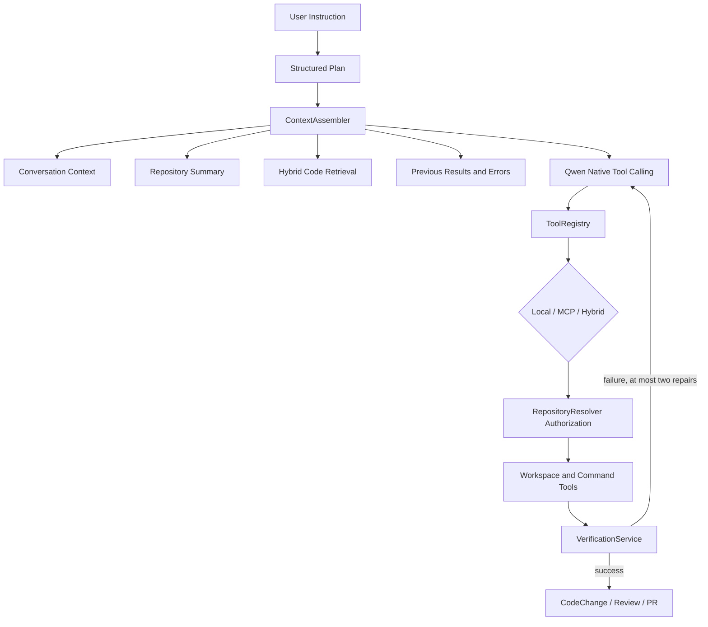

# AgentHub 项目流程图

本文档描述当前 AgentHub 的主要业务链路和系统边界。图表使用 Mermaid，可在支持 Mermaid 的 Markdown 查看器中直接渲染。

## 1. 系统总览

```mermaid
flowchart LR
    User[用户浏览器] --> Frontend[agenthub-frontend<br/>React + Vite]
    Frontend -->|HTTP /api| Backend[FastAPI Backend]
    Frontend -->|WebSocket /ws/conversations/{id}| WS[WebSocket Router]

    Backend --> DB[(SQLite / SQLAlchemy)]
    Backend --> Redis[(Redis Pub/Sub + Celery Broker)]
    Backend --> Workspace[本地 Workspaces<br/>Git 仓库工作区]
    Backend --> Preview[previews 静态预览目录]
    Backend --> GitHub[GitHub API]

    Redis --> Worker[Celery Worker]
    Worker --> DB
    Worker --> Workspace
    Worker --> LLM[Qwen / LangGraph]
    Worker --> Redis

    Redis --> WS
    WS --> Frontend
```

## 2. 用户消息到任务创建



## 3. Orchestrator 计划确认流程

```mermaid
flowchart TD
    A[用户发送 @orchestrator 目标] --> B[创建父任务<br/>metadata.plan_status=planning]
    B --> C[Celery run_orchestrator_task]
    C --> D[LangGraph planner 调用 LLM 拆解任务]
    D --> E[保存 plan 到父任务 metadata_json]
    E --> F[创建子任务<br/>graph_subtask]
    F --> G[父任务回到 PENDING<br/>plan_status=awaiting_confirmation]
    G --> H[前端任务面板展示 Plan]
    H --> I{用户确认?}
    I -->|否| G
    I -->|是| J[POST /api/tasks/{id}/plan/confirm]
    J --> K[plan_status=confirmed]
    K --> L[再次投递 run_orchestrator_task]
    L --> M[LangGraph executor 顺序执行子任务]
    M --> N[verifier 校验输出]
    N -->|有错误| M
    N -->|完成| O[summarizer 汇总结果]
    O --> P[父任务 SUCCESS<br/>plan_status=executed]
```

## 4. Worker 执行任务

```mermaid
flowchart TD
    A[Celery Worker 接收 task_id] --> B[读取 Task]
    B --> C[状态 RUNNING<br/>started_at=now]
    C --> D{会话是否绑定 Repository?}
    D -->|是| E[prepare_branch<br/>agent-task-{task_id}]
    D -->|否| F[无 repo_path]
    E --> G[选择 Adapter]
    F --> G
    G --> H{adapter_type}
    H -->|mock| I[MockAgentAdapter]
    H -->|qwen| J[QwenAgentAdapter]
    H -->|langgraph| K[LangGraphOrchestratorAdapter]
    I --> L[返回 AgentRunResult]
    J --> M[LLM 输出 FILE/DELETE/RENAME 标记]
    M --> N[WorkspaceService 安全落盘]
    K --> L
    N --> L
    L --> O{成功?}
    O -->|是| P[Task SUCCESS<br/>result_summary<br/>finished_at]
    O -->|否| Q[Task FAILED<br/>error_message<br/>finished_at]
    P --> R[WebSocket task.updated]
    Q --> R
```

## 5. CodeChange 生成、审核、修订

```mermaid
flowchart TD
    A[任务 SUCCESS] --> B[用户点击 Diff 或自动修订生成]
    B --> C[POST /api/code-changes/generate<br/>或 revision 自动生成]
    C --> D[Git add -A]
    D --> E[获取 changed_files + diff_text]
    E --> F[保存 CodeChange<br/>status=generated]
    F --> G[前端 Diff 面板展示]

    G --> H{用户选择}
    H -->|Accept| I[POST /code-changes/{id}/accept]
    I --> J[status=accepted]
    H -->|Reject| K[POST /code-changes/{id}/reject]
    K --> L[status=rejected<br/>reject_reason]
    L --> M[用户点击 Revise]
    M --> N[POST /code-changes/{id}/revise]
    N --> O[创建 revision Task]
    O --> P[Worker 修改本地文件]
    P --> Q[revision 成功后自动生成新 CodeChange]
    Q --> R[parent_code_change_id 指向上一版<br/>revision_index + 1]
```

## 6. Review 流程

```mermaid
flowchart TD
    A[用户在 Diff 面板点击 Review] --> B[POST /api/code-changes/{id}/review]
    B --> C[校验 CodeChange 归属]
    C --> D[CodeReviewService 扫描 diff]
    D --> E[规则识别风险<br/>secret / eval / innerHTML / auth / SQL / storage]
    E --> F[生成 risk_level]
    F --> G[保存 CodeReview]
    G --> H[publish code_review.created]
    H --> I[前端展示 summary、findings、recommendations]
```

## 7. Deploy 本地预览流程



## 8. Pull Request 流程

```mermaid
flowchart TD
    A[用户点击 Create PR] --> B[POST /api/pull-requests]
    B --> C[校验 CodeChange accepted]
    C --> D[checkout agent-task-{task_id}]
    D --> E[commit_changes]
    E --> F[push_branch]
    F --> G[GitHub API create_pull_request]
    G --> H[保存 PullRequest]
    H --> I[保存 pr_number/html_url/state/merged/base/head]
    I --> J[CodeChange 标记 committed]
    J --> K[publish pull_request.created]
```

## 9. 安全与稳定性链路



## 10. 删除对话级联清理

```mermaid
flowchart TD
    A[DELETE /api/conversations/{id}] --> B[校验会话归属]
    B --> C[查询会话下所有 Task]
    C --> D[撤销 celery_task_id]
    D --> E[查询 CodeChange ids]
    E --> F[删除 CodeReview]
    F --> G[删除 PullRequest]
    G --> H[删除 Deployment]
    H --> I[删除 CodeChange]
    I --> J[解除 Task 父子引用]
    J --> K[删除 Task]
    K --> L[删除 Message]
    L --> M[删除 Conversation]
```

## 11. 前端运行时请求地址



## 12. Hardened Agent 开发闭环



模型可见工具参数不包含 `repository_id`、`user_id` 或 `local_path`。可信 identity 来自 Task/Conversation；RepositoryResolver 验证归属，WorkspaceService 验证路径，CommandRunner 限制 argv，VerificationService 使用真实命令判定是否推进。

旧图第 4 节中的 FILE/DELETE/RENAME 标记仅代表历史兼容流程；当前默认路径是 Native Tool Calling，legacy marker fallback 默认关闭。

